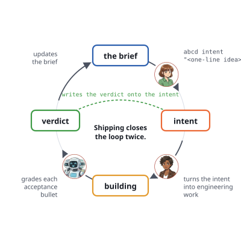

# Process

**It starts with the brief.** You sit down with your facilitator and whatever discovery material you have — recordings, notes, a shared workspace, a half-finished slide deck, a transcript of yesterday's stakeholder call. Your facilitator works that material into a plain-language draft of your project's brief, and the parts that feel fuzzy you sharpen together in conversation. *(Automating that first pass — a discovery-ingest surface and a Socratic-interview sub-verb of `abcd intent` — is a design target, not yet shipped.)* By the end of the session you have a brief that says — in language a stakeholder would recognise — what this project is about. Much of it is ambition rather than fact at this stage, and that's fine: The brief never bluffs, so those passages are marked accordingly.



## Capturing intents

**Ideas become intents.** From then on, whenever an idea arrives, capturing it is one line:

```bash
abcd intent "<one-line idea>"
```

Your facilitator helps sharpen the press release and its acceptance criteria — the criteria are a hard gate, not a suggestion — then turns the intent into engineering work, surfaces the cross-cutting concerns it implies, and lets AI coding agents do the building. You stay in the seat where your judgement matters most: Setting the *why* at the start, and reading the verdict at the end.

**Shipping closes the loop twice.** When the work lands, the *intent auditor* grades each acceptance bullet against the actual repository — the code, the configs, the tests, the docs — and writes the verdict onto the intent. And the same change updates the brief: The passage covering this capability loses its not-yet-real marking and is rewritten to describe what actually shipped. That second half is what keeps the brief honest — the true description of your project, one shipped change at a time, instead of a wish list nobody trusts.

Acceptance criteria for each intent use three words to describe a checkable outcome.

|  | What it pins down |
|------|-------------------|
| **Given** | The starting state — what's already true before anything happens. |
| **When** | The trigger — a single user or system action. |
| **Then** | The observable outcome — something a human (or the intent auditor) can check by *looking at the result*, not by reading the author's intent. |

The auditor is allowed to fail honestly. If a promise wasn't kept, it says so. If something was delivered but with a wrinkle worth your attention, it flags the wrinkle rather than glossing it. And if it genuinely couldn't tell from the repo, it says *that* — which is different from saying the promise wasn't met, and `abcd` insists on the distinction.

## Capturing issues & thoughts

While intents are at the core of `abcd`, you will sometimes find that a thought that *feels* relevant crosses your mind — a half-formed observation, a question for the team, a doubt about the brief, a behaviour you'd expect a user to notice — and you don't want to lose it. Instead of articulating an intent, `abcd` has a fast hatch for capturing it:

```bash
abcd capture "<whatever crossed your mind>"
```

One line, deliberately shaped like intent capture but for un-typed thoughts: `abcd capture` writes one small record into the repo's issue ledger (`.abcd/work/issues/open/`), minted with a collision-resistant id (`iss-<yymmddHHMMSS><4 random digits>`) that two parallel agents are overwhelmingly unlikely to duplicate, and that nothing ever renumbers. Everything else — severity, category, where it was found — has sensible defaults, so you don't have to decide anything beyond the text itself at this stage.

`abcd capture` essentially decouples retention from classification. Intents demand press-release discipline — a named user, acceptance criteria, a *why*. Forcing a half-formed doubt through that discipline either kills the thought (too much ceremony, you let it go) or pollutes the intent corpus (you file something vague to avoid losing it). The *fast hatch* makes retention almost free — seconds, zero decisions — and defers the "*what is this?*" question to someone in the right seat at the right time.

That "someone" is your technical facilitator, who triages those captures later: They sweep the open captures and route each one — a bug gets fixed (finding first, fix after); a feature seed gets promoted into an intent draft; a doubt about the brief becomes a brief correction; a deliberate non-action goes to `wontfix` with the reasoning recorded, so the question never gets re-litigated.
